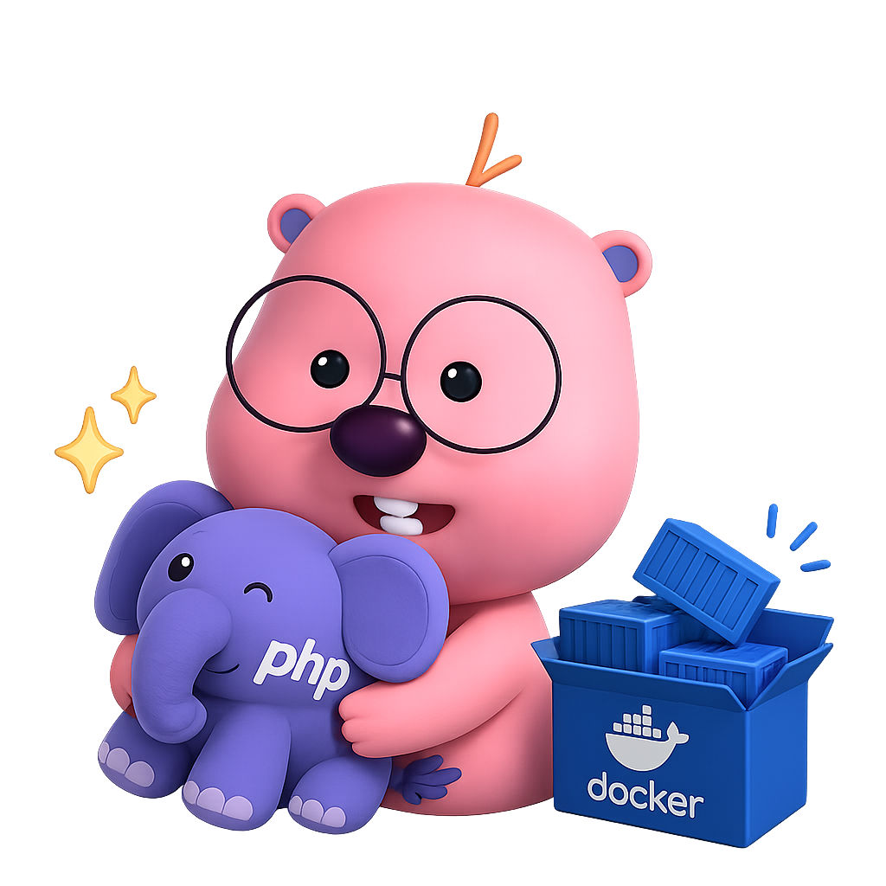

# learn-php-pure-with-loopy

<p align="center">
  
</p>

A personal repository for code examples, small projects, and technical notes written in **Native PHP 8.4+**. This space
is dedicated to learning, experimenting, and sharing the latest PHP features through practical use cases.

---

## 1. Project List & Notes

```text
learn-php-pure-with-loopy/
└── projects/
    └── 01-hello-world/

```

---

## 2. Environment

* **Host OS:** Linux / WSL2 / macOS
* **Virtualization:** Docker / Docker Compose
* **Language Runtime:** PHP 8.4+ (Pre-configured inside each project's container)

---

## 3. Getting Started

Since every project runs on an isolated Docker environment, deployment is handled directly inside each project's
directory:

1. **Clone the repository:**

```bash
git clone https://github.com/your-username/learn-php-pure-with-loopy.git
cd learn-php-pure-with-loopy

```

2. **Navigate to a specific project and start the container:**

```bash
cd projects/01-hello-world
docker compose up -d

```